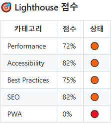
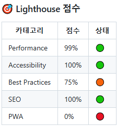
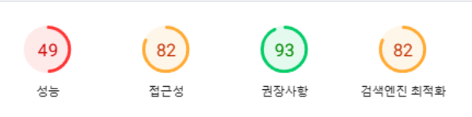
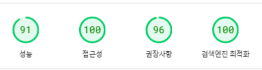
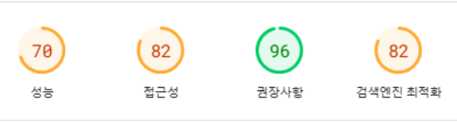

# 성능 최적화 Basic

# 바닐라 JS 프로젝트 성능 개선

- url: [https://d1dex060uws42h.cloudfront.net/](https://d1dex060uws42h.cloudfront.net/)

## 성능 개선 보고서

### Lighthouse

| 항목       | 개선 전                                                  | 개선 후                                           |
| ---------- | -------------------------------------------------------- | ------------------------------------------------- |
| Lighthouse |  |  |

| 항목   | 개선 전 | 개선 후 | 개선 비율 |
| ------ | ------- | ------- | --------- |
| 성능   | 72%     | 99%     | 27% 개선  |
| 접근성 | 82%     | 100%    | 18% 개선  |
| SEO    | 82%     | 100%    | 18% 개선  |

### Speed Insight

| Speed Insight | 개선 전                                                            | 개선 후                                                     |
| ------------- | ------------------------------------------------------------------ | ----------------------------------------------------------- |
| Mobile        |    |    |
| Desk top      |  |  |

#### 모바일

| 모바일   | 개선 전 | 개선 후 | 개선 비율 |
| -------- | ------- | ------- | --------- |
| 성능     | 49%     | 91%     | 42% 개선  |
| 접근성   | 82%     | 100%    | 18% 개선  |
| 권장사항 | 93%     | 96%     | 3% 개선   |
| SEO      | 82%     | 100%    | 18% 개선  |

#### 데스크탑

| 데스크탑 | 개선 전 | 개선 후 | 개선 비율 |
| -------- | ------- | ------- | --------- |
| 성능     | 70%     | 99%     | 29% 개선  |
| 접근성   | 82%     | 100%    | 18% 개선  |
| 권장사항 | 96%     | 100%    | 4% 개선   |
| SEO      | 82%     | 100%    | 18% 개선  |
