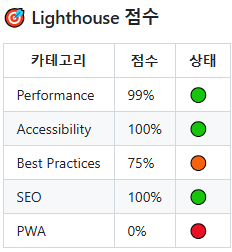
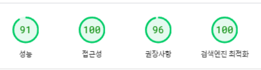
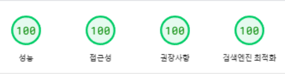
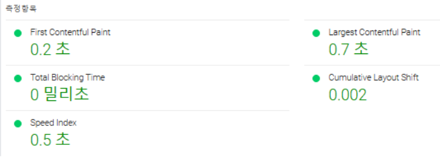

# 분석 도구

1. Lighthouse(issued by github action) [git lighthouse 링크](https://github.com/sangwon1222/front_3rd_chapter4-2_basic/issues)
2. SpeedInsight [pagespeed 링크](https://pagespeed.web.dev/)

# 분석 지표

1. 로딩 성능

- FCP (First Content Paint): 최초 콘텐츠 렌더링 시간
- LCP (Largest Content Paint): 최대 콘텐츠 렌더링 시간
- TTI (Time to Interactive): 상호작용 가능 시간
- TBT (Total Blocking Time): 총 차단 시간
- Speed Index: 페이지 로딩 속도 지표
-

2. 렌더링 성능

- CLS (Cumulative Layout Shift): 누적 레이아웃 이동
-

3. 자바스크립트 성능

- 실행 시간 (DOM Content/Interactive/Onload Time)
-

4. 네트워크 성능

- Resource Size: 리소스 크기
- Number of Requests: 요청 수
- TTFB (Time to First Byte): 최초 바이트 수신 시간

# 성능 도표

## Lighthouse

[개선 전 Lighthouse](https://github.com/sangwon1222/front_3rd_chapter4-2_basic/issues/2)

[개선 후 Lighthouse](https://github.com/sangwon1222/front_3rd_chapter4-2_basic/issues/13)

| 항목       | 개선 전                                             | 개선 후                                      |
| ---------- | --------------------------------------------------- | -------------------------------------------- |
| Lighthouse |  |  |

| -             | 개선 전 | 개선 후 | 개선 비율 |
| ------------- | ------- | ------- | --------- |
| 성능          | 72%     | 99%     | 27% 개선  |
| 접근성        | 82%     | 100%    | 18% 개선  |
| Best Practice | 75%     | 75%     | 0% 개선   |
| SEO           | 82%     | 100%    | 18% 개선  |
| PWA           | 0%      | 0%      | 0% 개선   |

## Speed Insight

| Speed Insight | 개선 전                                                                   | 개선 후                                                            |
| ------------- | ------------------------------------------------------------------------- | ------------------------------------------------------------------ |
| Mobile        |                |                |
| -             |    |    |
| Desk top      |              |              |
| -             |  |  |

## 모바일

| -          | 개선 전  | 개선 후 | 개선 비율     |
| ---------- | -------- | ------- | ------------- |
| FCP        | 2.8 (s)  | 1.2 (s) | 1.6 (s) 개선  |
| LCP        | 11.4 (s) | 2.1 (s) | 9.3 (s) 개선  |
| TBT        | 830 (ms) | 50 (ms) | 780 (ms) 개선 |
| CLS        | 0.009    | 0.169   | - 0.160 개선  |
| SpeedIndex | 4.4 (s)  | 1.2 (s) | 3.2 (s) 개선  |

## 데스크탑

| -          | 개선 전  | 개선 후 | 개선 비율    |
| ---------- | -------- | ------- | ------------ |
| FCP        | 0.7 (s)  | 0.2 (s) | 0.5 (s) 개선 |
| LCP        | 1.6 (s)  | 0.7 (s) | 0.9 (s) 개선 |
| TBT        | 180 (ms) | 0 (ms)  | 180 개선     |
| CLS        | 0.429    | 0.002   | 0.427 개선   |
| SpeedIndex | 0.7 (s)  | 0.5 (s) | 0.2 (s) 개선 |

# 향후 개선

1. 모바일 CLS가 오히려 안좋아졌는데 원인 파악과 코드 스플리팅.
